JavaFX 9 Examples
=================

In reversed order.

6: User Interface Controls
--------------------------

### [HeroPicker](src/main/java/learnfx/javafx9be/ch06controls/HeroPicker.java)

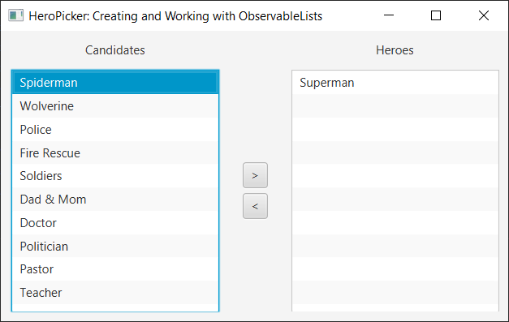

### [KeyCombinationsAndContextMenus Example](src/main/java/learnfx/javafx9be/ch06controls/KeyCombinationsAndContextMenus.java)

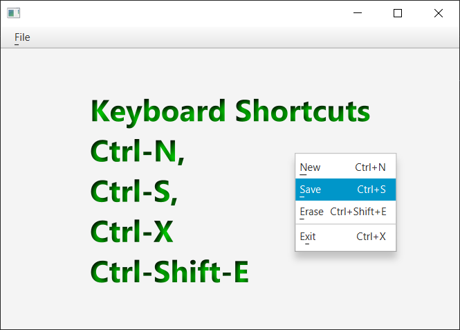

### [MenuExample](src/main/java/learnfx/javafx9be/ch06controls/MenuExample.java)

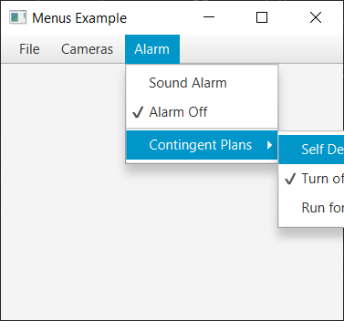

### [ButtonFun](src/main/java/learnfx/javafx9be/ch06controls/ButtonFun.java)

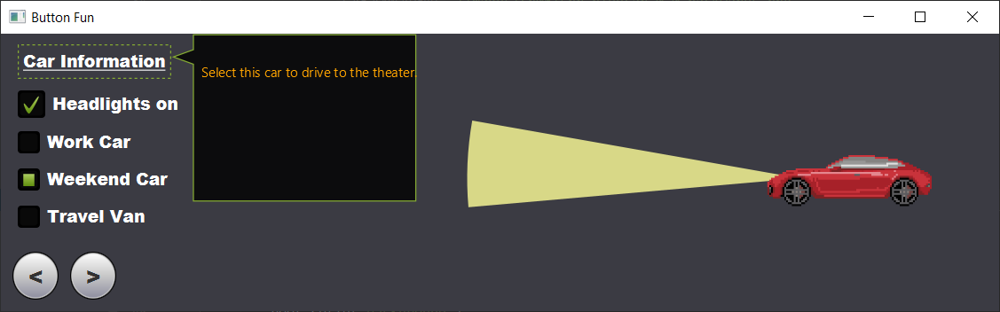

### [RadioButtons Example](src/main/java/learnfx/javafx9be/ch06controls/RadioButtonsExample.java)

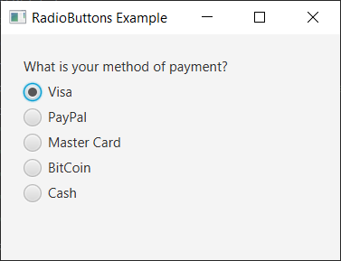

### [LabelAwesome Example](src/main/java/learnfx/javafx9be/ch06controls/LabelAwesome.java)

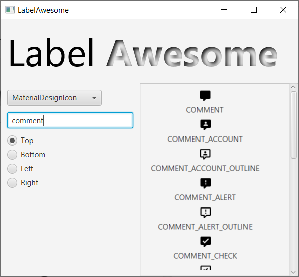

5: Layouts and Scene Builder
----------------------------

### [FXMLContact Form Example](src/main/java/learnfx/javafx9be/ch05layouts/fxmlusage/FXMLContactForm.java)

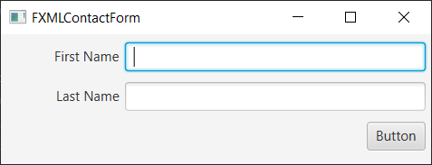

### [GridPane Form Example](src/main/java/learnfx/javafx9be/ch05layouts/gridpane/GridPaneForm.java)

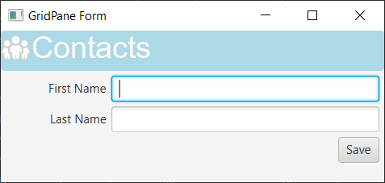

### [VBox Example](src/main/java/learnfx/javafx9be/ch05layouts/VBoxExample.java)

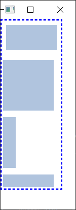

### [HBox Example](src/main/java/learnfx/javafx9be/ch05layouts/HBoxExample.java)

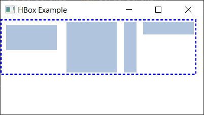

4: Lambdas and Properties
-------------------------

### [Form Validation](src/main/java/learnfx/javafx9be/ch04lambda/FormValidation.java)

3: JavaFX Fundamentals
----------------------

### [Changing Text Fonts](src/main/java/learnfx/javafx9be/ch03fund/ChangingTextFonts.java)

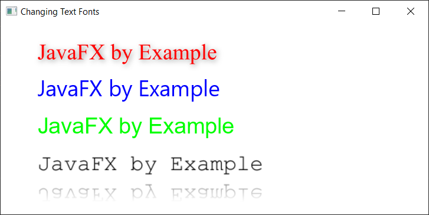

### [Drawing Text](src/main/java/learnfx/javafx9be/ch03fund/DrawingText.java)

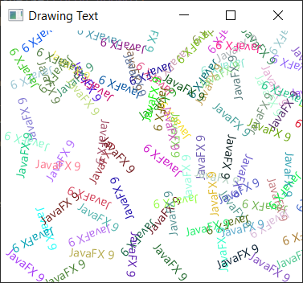

### [Painting Colors](src/main/java/learnfx/javafx9be/ch03fund/PaintingColors.java)

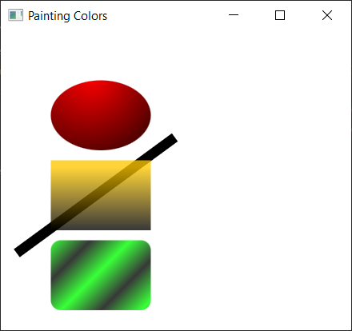

### [Drawing Shapes](src/main/java/learnfx/javafx9be/ch03fund/DrawingShapes.java)

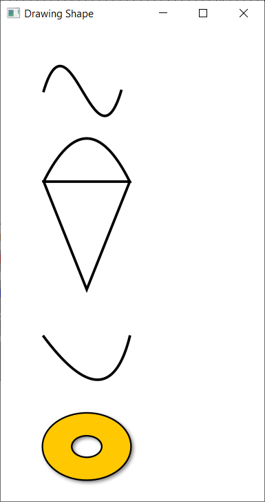

### [Drawing Lines](src/main/java/learnfx/javafx9be/ch03fund/DrawingLines.java)

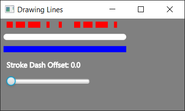

