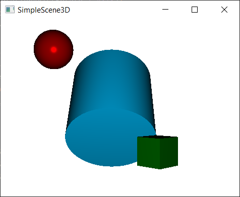
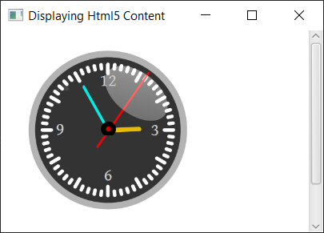
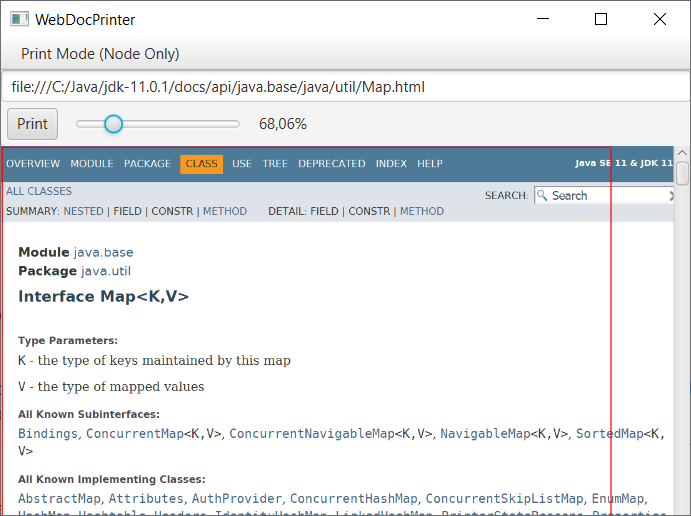
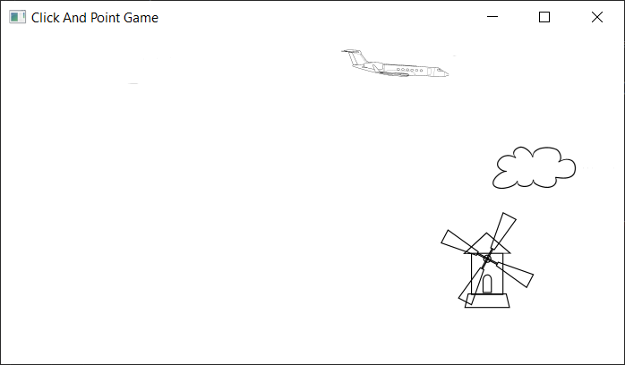
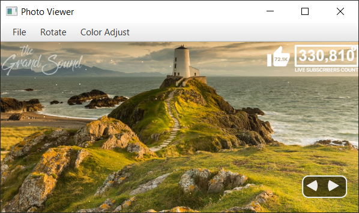
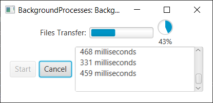
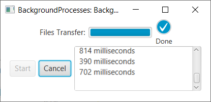
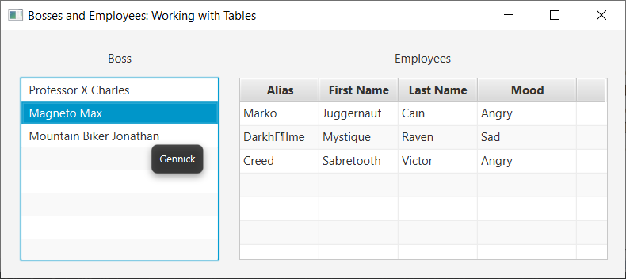

JavaFX Examples
===============

In reversed order.

11: JavaFX 3D 
-------------

### [SimpleScene3D Example](src/main/java/learnfx/javafx9be/ch11javafx3d/SimpleScene3D.java)

10: JavaFX on the Web 
---------------------

### [DisplayingHtml5Content Example](src/main/java/learnfx/javafx9be/ch10web/DisplayingHtml5Content.java)

### [WebViewUsage Example](src/main/java/learnfx/javafx9be/ch10web/WebViewUsage.java)

8: Printing
-----------

### [WebDocPrinter Example](src/main/java/learnfx/javafx9be/ch08printing/WebDocPrinter.java)

7: Graphics
-----------

### [ClickAndPointGame Example](src/main/java/learnfx/javafx9be/ch07graphics/animation/ClickAndPointGame.java)

### [PhotoViewer Example](src/main/java/learnfx/javafx9be/ch07graphics/photoviewer/PhotoViewer.java)

6: User Interface Controls
--------------------------

### [BackgroundProcesses Example](src/main/java/learnfx/javafx9be/ch06controls/BackgroundProcesses.java)

    

### [BossesAndEmployees - TableView Example](src/main/java/learnfx/javafx9be/ch06controls/BossesAndEmployees.java)

### [HeroPicker](src/main/java/learnfx/javafx9be/ch06controls/HeroPicker.java)

### [KeyCombinationsAndContextMenus Example](src/main/java/learnfx/javafx9be/ch06controls/KeyCombinationsAndContextMenus.java)

### [MenuExample](src/main/java/learnfx/javafx9be/ch06controls/MenuExample.java)

### [ButtonFun](src/main/java/learnfx/javafx9be/ch06controls/ButtonFun.java)

### [RadioButtons Example](src/main/java/learnfx/javafx9be/ch06controls/RadioButtonsExample.java)

### [LabelAwesome Example](src/main/java/learnfx/javafx9be/ch06controls/LabelAwesome.java)

5: Layouts and Scene Builder
----------------------------

### [FXMLContact Form Example](src/main/java/learnfx/javafx9be/ch05layouts/fxmlusage/FXMLContactForm.java)

### [GridPane Form Example](src/main/java/learnfx/javafx9be/ch05layouts/gridpane/GridPaneForm.java)

### [VBox Example](src/main/java/learnfx/javafx9be/ch05layouts/VBoxExample.java)

### [HBox Example](src/main/java/learnfx/javafx9be/ch05layouts/HBoxExample.java)

4: Lambdas and Properties
-------------------------

### [Form Validation](src/main/java/learnfx/javafx9be/ch04lambda/FormValidation.java)

3: JavaFX Fundamentals
----------------------

### [Changing Text Fonts](src/main/java/learnfx/javafx9be/ch03fund/ChangingTextFonts.java)

### [Drawing Text](src/main/java/learnfx/javafx9be/ch03fund/DrawingText.java)

### [Painting Colors](src/main/java/learnfx/javafx9be/ch03fund/PaintingColors.java)

### [Drawing Shapes](src/main/java/learnfx/javafx9be/ch03fund/DrawingShapes.java)

### [Drawing Lines](src/main/java/learnfx/javafx9be/ch03fund/DrawingLines.java)

